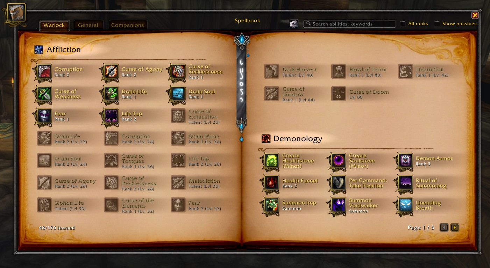
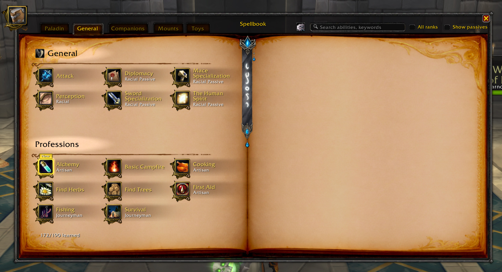

# ModernSpellBook

A modern, retail-inspired spellbook replacement for **Turtle WoW** (1.12.1 vanilla client). Originally ported from the Classic Season of Discovery addon by the same name.

## Features

- **Two-page book layout** with parchment background and bookmark
- **Tabbed navigation** - Class spells, General, Pet, Companions, Mounts, Toys
- **Professions subcategory** - profession spells automatically grouped separately in the General tab
- **Search** - filter spells by name or keyword
- **Show/hide passives** and **all spell ranks** toggles
- **Round passive icons** with portrait masking and blue ring border
- **Unlearned spells** (greyed out) - visit a class trainer to populate the full spell list
  - Talent-granted spells detected automatically
  - "Train" badge on spells available at your current level
  - "New" badge on freshly learned spells
- **Cooldown display** on spell icons
- **Active aura/stance tracking** with real-time glow updates
- **Spell tooltips** with descriptions for unlearned spells (captured from trainer)
- **Settings menu** (gear icon) with:
  - Show unlearned spells toggle
  - Highlights control (glow/badge per category)
  - Font size selector
  - Light/Dark text color mode
  - Spell icon frame visibility per category

## Screenshots

### Class Spells

### General & Professions

### Unlearned Spells, Talents & Badges

## Installation

1. Download or clone this repository into your `Interface/AddOns/` folder
2. Ensure the folder is named `ModernSpellBook`
3. Restart the game or `/reload`

## Unlearned Spells

To see unlearned spells in your spellbook, visit a class trainer in a major city. The addon captures the full spell list on your first visit and reuses it across sessions. Higher-level trainers provide more complete data.

## Compatibility

- **Turtle WoW** (Interface 11200) - primary target
- **Vanilla 1.12.1** - should work on other 1.12.1 private servers
- Requires no external dependencies

## Credits

- Original [ModernSpellBook](https://www.curseforge.com/wow/addons/modern-spellbook) addon for WoW Classic Season of Discovery
